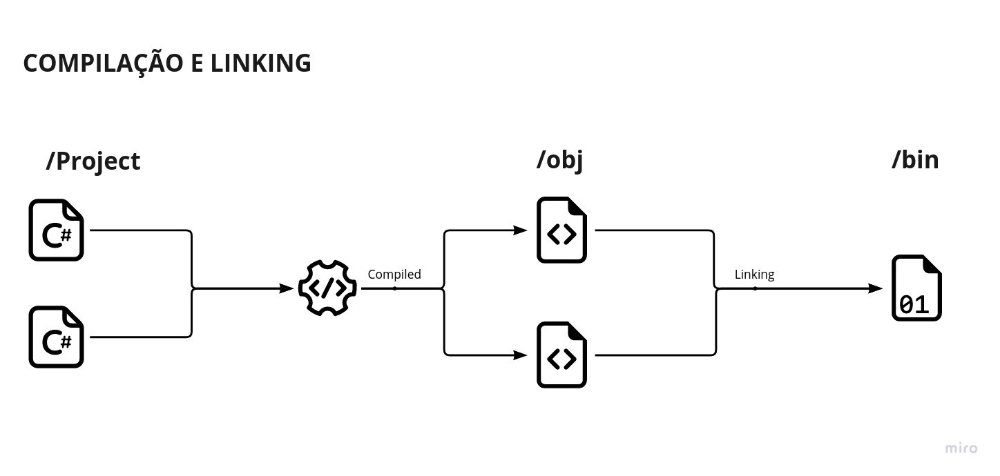
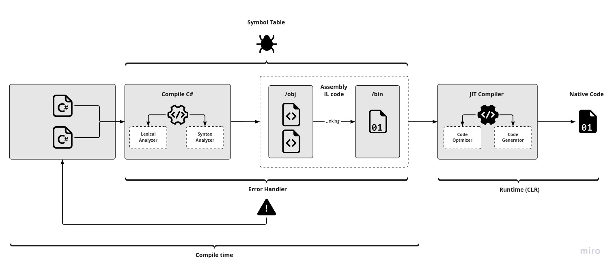

# Artigo 2

## Introdução

Neste segundo artigo, minha intenção é explorar os recursos iniciais de
desenvolvimento .NET com a linguagem C#, uma linguagem moderna, orientada a
objetos e fortemente tipada. Se você ainda não está completamente familiarizado
com esta linguagem, não se preocupe, iremos nos aprofundar nos estudos cada vez
mais.

[No artigo anterior](https://dev.to/dvths/me-tornando-um-desenvolvedor-net-0-1n15),
abordei alguns conceitos introdutórios sobre a plataforma, seus componentes e
recursos. Eu recomendo que você o leia para poder compreender melhor, se for o
caso, alguns pontos que irei abordar mais para frente. Vou considerar que já
conhecemos basicamente o que é e para que serve o .NET, e que já temos o SDK
(Software Development Kit) instalado.

Eu estudo em um Arch Linux. Isso é importante destacar por duas razões:
Primeiro: porque o IDE (Integrated Development Environment) Visual Studio,
indicado para desenvolvimento .NET, não tem suporte para Linux. Apesar de um IDE
possuir diversos recursos que facilitam o desenvolvimento, o Visual Studio Code
dá conta do recado neste momento de aprendizado. Particularmente, eu uso Neovim
0.7 com
[Language Server Protocol](https://docs.microsoft.com/en-us/visualstudio/extensibility/language-server-protocol?view=vs-2022)
configurado. Segundo: eu começarei estudando a CLI (Command Line Interface) do
dotnet, algo que um usuário do IDE usará poucas vezes no dia a dia. Portanto,
alguns podem considerar irrelevante parte desse conteúdo e podem pular para o
que achar mais relevante.

## Tópicos

- [Visão geral da CLI (Command Line Interface)](#visão-geral-da-cli)
- [Estrutura de comandos da CLI](#estrutura-de-comando)
- [Estudando um aplicativo de console](#estudando-um-aplicativo-de-console)
- [Fluxo de compilação](#fluxo-de-compilação)
- [Namespaces](#namespaces)
- [Arquivos de projeto e Entry Point](#arquivos-de-projeto-e-entry-point)
- [Resumo](#resumo)
- [Referências](#referências)

---

# Visão Geral da CLI

A Interface de Linha de Comando do .NET é uma ferramenta multiplataforma para
desenvolvimento, criação, execução e publicação de aplicações .NET e vem como
parte do conjunto de recursos do SDK.

Como a maioria das CLIs, a do .NET consiste no driver – um arquivo executável –
opções e argumentos de comando. O driver (dotnet) tem basicamente as seguintes
responsabilidades:

**Executar programas:** abrange o fluxo de desenvolvimento, isto é, execução de
testes, compilação do código e comandos de migração para atualizar projetos.

**Gerenciar dependências:** abrange instalação, remoção, limpeza após a
instalação de pacotes e atualização dos pacotes.

**Criar e publicar pacotes:** abrange tarefas como criar um pacote compactado e
efetuar um push do pacote para um registro, por exemplo (aos poucos veremos cada
uma dessas coisas).

[Voltar aos tópicos](#tópicos)

---

# Estrutura de comando

```bash
$ dotnet <COMANDO> [opções-do-comando] [argumentos]
```

Quando passamos um comando para o executável (dotnet) inicia-se a execução
daquele comando, por exemplo:

```bash
$ dotnet build
```

Esse comando constrói um projeto com suas dependências (também veremos como isso
acontece mais para frente.)

```bash
$ dotnet new --list
```

Lista uma séries de opções de modelos pré preparados que você pode criar.

Cada comando define suas próprias opções e argumentos e também possuem uma opção
`--help` muito útil quando se sentir perdido.

Portanto, temos:

**Comando:**

Executa uma ação: compila o código, adiciona pacotes, referências ou publica o
código (veremos mais para frente).

**Argumentos:**

Argumentos que você passa na linha de comando são aqueles do comando invocado.
Por exemplo, quando você executa `dotnet publish my_app.csproj`, o argumento
`my_app.csproj` indica que o projeto a ser publicado é passado para o comando
publish.

**Opções:**

As opções são aquelas do comando invocado. Por exemplo:
`dotnet publish --output /build_output`, é a opção que indica o caminho da saída
do aplicativo a ser publicado e esse valor é passado para o comando publish.

Uma lista completa dos comandos do CLI .NET e seus detalhes pode ser consultados
[aqui](https://docs.microsoft.com/en-us/dotnet/core/tools/dotnet?source=recommendations#dotnet-commands),
mas lembre-se sempre da opção `--help`.

[Voltar aos tópicos](#tópicos)

---

# Estudando um aplicativo de console

Antes de iniciar um projeto, é importante saber que, ao instalar o SDK do .NET,
recebemos dezenas de modelos pré preparados como aplicativos de console,
bibliotecas de classes, projetos de testes unitários, aplicativos ASP.NET, etc.
Para listar esses modelos disponíveis, como vimos acima, executamos o comando
`dotnet new` com a opção `-l` ou `--list`.

Para iniciar um aplicativo de console, você pode executar:
`$ dotnet new console.` Contudo, você pode usar a opção `--help` tanto após
`new` quanto após console para verificar as opções disponíveis para cada. Se
fizer isso após o comando `new`, verá que existem duas opções (-n e -o) ambas
direcionam a saída gerada em um diretório nomeado por você. Portanto, se
executar:

```bash
$ dotnet new console -o HelloWorld
```

Verá que um diretório será criado com o valor passado para opção `-o` , no caso,
`HelloWorld`. O mesmo o corre com a opção `n`. Crie um projeto console chamado
HelloWorld e dê uma espiada no que existe dentro dele:

```shell

$ tree HelloWorld
HelloWorld
├── HelloWorld.csproj
├── obj
│   ├── HelloWorld.csproj.nuget.dgspec.json
│   ├── HelloWorld.csproj.nuget.g.props
│   ├── HelloWorld.csproj.nuget.g.targets
│   ├── project.assets.json
│   └── project.nuget.cache
└── Program.cs

1 directory, 7 files

```

Essa é a estrutura básica do projeto e, durante o artigo, veremos o que são
todos esses arquivos. Se abrirmos o arquivo `Program.cs`, teremos a instrução
clássica _Hello, World_. Não é nenhuma novidade que, se executarmos esse código,
a mensagem será impressa no console. Para fugir um pouco desse padrão, vamos
começar tentando algo diferente.

A maioria dos programas processa alguma entrada para produzir uma saída;
basicamente essa é a definição de computação. Um programa obtêm dados de entrada
de maneiras diversas, mas, com frequência, a entrada vem de uma fonte externa:
um arquivo, uma conexão de rede, os dados da saída de outro programa ou de um
usuário em um teclado. No arquivo `Program.cs`, você pode apagar o que estiver
escrito e colar o seguinte código:

```csharp
namespace HelloWorld;

class Program
{
    static void Main(string[] args)
    {
        string path = @"./message.txt";
        if (!File.Exists(path))
        {
            // Crie um arquivo e grave uma mensagem nele.
            using StreamWriter message = File.CreateText(path);
            message.WriteLine("Olá, Mundo");
        }
        // Leia o conteúdo do arquivo criado.
        using (StreamReader message = File.OpenText(path))
        {
            string content;
            while ((content = message.ReadLine()) != null)
            {
                Console.WriteLine(content);
            }
        }
    }
}
```

Não precisamos nos preocupar com a sintaxe do C#, nesse momento. Entretanto, o
que este código faz é criar um arquivo no diretório atual chamado message.txt e
gravar nele a mensagem “Olá, Mundo!”, depois, enquanto existirem bytes para
serem lidos, ele imprime no console o conteúdo desse arquivo. Quando isso se
torna falso, o programa encerra.

Muita coisa pode ser dita a respeito deste código. Por exemplo, no primeiro
artigo conhecemos os conceitos de código gerenciado e não gerenciado e como o
.NET trabalha com esses conceitos. File, aqui, é um exemplo de tipo gerenciado
que acessa recursos não gerenciados pelo CLR (no caso, cria um arquivo e o
acessa no contexto do dispositivo). Note que o arquivo .txt foi criado na pasta
atual.

```bash
$ tree -L 1
.
├── bin
├── message.txt
├── obj
├── Program.cs
└── HelloWorld.csproj

```

Há muitos outros tipos de recursos não gerenciados e tipos de biblioteca de
classes que os encapsula.

`File`, `StreamWriter` e `StreamReader`, são tipos que lidam com fluxos de dados
permitindo leitura e gravação em arquivos definidos na biblioteca `IO`
(Input/Output) no **namespace** `System.IO` que fornece suporte básico a
arquivos e diretórios do sistema operacional. O `Console.WriteLine()` também é
um tipo definido no namespace System, ou seja, `System.Console.WriteLine`. Mas,
não se preocupe pois, na próxima seção, veremos mais sobre namespaces.

Se você estiver se perguntando o motivo de não ver nada relacionado a declaração
de bibliotecas no código, eu te digo que nem sempre foi assim. Antes da versão
10 do C#, era necessário declarar namespaces individuais usando a diretiva
`using` no topo de cada arquivo, por exemplo:

```c
using System;
using System.Io;

class Program
{
 ...

```

Mas o uso de alguns namespaces eram (e ainda são) muitos comuns, portanto, com a
versão 10 do C# foi estabelecido as
[diretivas globais de uso](https://github.com/dotnet/csharplang/blob/main/proposals/csharp-10.0/GlobalUsingDirective.md),
que, entre outros detalhes, permitem ao compilador considerar certos namespaces
para todo o projeto. Isso quer dizer que o SDK importa implicitamente os
seguintes namespaces:

- [System](https://learn.microsoft.com/en-us/dotnet/api/system?view=net-7.0)
- [System.Collections.Generic](https://learn.microsoft.com/en-us/dotnet/api/system.collections.generic?view=net-7.0)
- [System.IO](https://learn.microsoft.com/en-us/dotnet/api/system.io?view=net-7.0)
- [System.Linq](https://learn.microsoft.com/en-us/dotnet/api/system.linq?view=net-7.0)
- [System.Net.Http](https://learn.microsoft.com/en-us/dotnet/api/system.net.http?view=net-7.0)
- [System.Threading](https://learn.microsoft.com/en-us/dotnet/api/system.threading?view=net-7.0)
- [System.Threading.Tasks](https://learn.microsoft.com/en-us/dotnet/api/system.threading.tasks?view=net-7.0)

Contudo, a diretiva `using`, que veremos mais para frente, ainda é necessária
para casos que fogem desse padrão.

Mas não entrarei a fundo nesses detalhes agora. A ideia é entender o que vai
acontecer agora: Execute `dotnet build` e note que um novo diretório foi
adicionado a raiz do projeto: `/bin`.

```bash
bin
└── Debug
    └── net6.0
        ├── HelloWorld
        ├── HelloWorld.deps.json
        ├── HelloWorld.dll
        ├── HelloWorld.pdb
        ├── HelloWorld.runtimeconfig.json
        └── ref
            └── HelloWorld.dll

```

Este é o produto resultante da construção do aplicativo. Aqui, temos o diretório
**Debug** que armazena um conjunto de arquivos binários, ou: **Os assemblies de
saída do programa**. Esse diretório inclui: o código do projeto em **IL**
(Intermediate Language) – vimos um pouco sobre isso no artigo anterior – com
extensão `.dll`.

- arquivos de símbolo de depuração, com uma extensão `.pdb` (veremos logo,
  logo).

- um arquivo `.deps.json`, que lista as dependências do aplicativo (ou
  biblioteca, se fosse o caso).

- um arquivo `.runtimeconfig.json`, que especifica o tempo de execução
  compartilhado e sua versão.

- pode conter também outras bibliotecas das quais o projeto depende (por meio de
  referências de projeto ou referências de pacote do **NuGet** que veremos no
  próximo artigo da série).

Vamos ver esse programa funcionando:

```bash
$ dotnet run

Olá, Mundo

```

Nesse ponto, você deve estar se perguntando sobre o diretório `obj`. Se você
reparou, um diretório **Debug** também foi gerado lá e, entre outras coisas,
também se encontram os **assemblies** de saída do programa. A próxima pergunta
que pode surgir é: Por que dois diretórios para a mesma coisa?

Na verdade, não são necessariamente a mesma coisa. Os dois diretórios armazenam
o código em IL, mas seus propósitos são distintos. E para deixar isso mais
claro, precisamos entender o processo de compilação.

[Voltar aos tópicos](#tópicos)

---

# Fluxo de compilação

Acontece que o uso coloquial da palavra “compilação” pode gerar certa confusão,
pelo menos para mim que sou meio lento. Muitas vezes, nos referimos a compilação
quando, na verdade, estamos nos referindo a **build** (construção). Compilação
não necessariamente é o mesmo que apenas gerar um arquivo executável. Em vez
disso, é um processo de vários estágios que, de maneira geral, pode ser dividido
em dois componentes: **compilação** e **linking**.



**Compilação** se refere ao processamento do código-fonte e a criação de
arquivos “objeto”, que são unidades compiladas individuais. É no processo de
compilação que também ocorre a análise sintática e léxica do código. Nesse
ponto, se algo não estiver em conformidade com as especificações do **CLS** ou
**CTS** (que vimos no artigo anterior), o processo é interrompido e um
manipulador de erros integrado ao compilador envia uma notificação apontando o
local do erro. Cada um desses arquivos objeto contém uma tradução do seu
código-fonte em IL e são armazenados no diretório **obj** – mas você não pode
executá-los! Porque ainda é preciso transformá-los em executáveis que seu
sistema operacional possa usar. É aí que entra o **Linker**.

**Linking** (ou vinculação) refere-se à criação de um único arquivo executável a
partir de vários arquivos objeto. Isso significa que todos esses arquivos de
código são compilados em uma unidade **assembly** armazenada em `/bin` e, que,
posteriormente, em tempo de execução, será **interpretado** pelo compilador
**JIT**, fornecido pelo **CLR**, da melhor maneira para se comunicar com as APIs
do sistema operacional, como estudamos no artigo anterior.

Por isso, esses arquivos de saída são divididos em `/obj` e `/bin`, mas também
possuem um diretório chamado **Debug**, pois, esse processo de compilação é
feito de forma a facilitar a depuração.

As informações de depuração, que facilitam o debug, são mapeadas naquele arquivo
com extensão `.pdb`. **PDB** significa **Program Database**, ele é gerado pelo
Linker e consiste em uma estrutura de dados empregada pelo compilador onde cada
identificador no código-fonte do programa é conectado com informações sobre sua
declaração, seu tipo, nível de escopo e, em alguns casos, a sua posição.

Os estágios de análise e síntese da compilação empregam informações a essa
estrutura (também chamada de tabela de símbolos) para verificar se os
identificadores usados foram especificados, para validar se as expressões e
atribuições são semanticamente precisas e para construir o IL de destino. Em
outras palavras, o arquivo `.pdb` mapeia vários componentes e instruções no
código-fonte para que o seu depurador possa usá-lo para localizar o arquivo de
origem e o local do executável no qual ele deve interromper um processo de
depuração. Sendo assim, seu programa é compilado com informações de depuração
junto com os **assemblies** e sem otimização. Porque a otimização complica a
depuração, afinal de contas, a relação entre o código-fonte e as instruções de
otimização geradas são bem mais complexas. Essa otimização, portanto, se faz
necessária apenas quando queremos distribuir nossa aplicação, um processo
chamado _release_. Mas, estudaremos isso em outro momento.

Com base no que acabamos de saber e no que estudamos no primeiro artigo, podemos
fazer um desenho do processo de compilação que pode ser mais ou menos como este:



Entendendo basicamente o processo de compilação e build, podemos entender melhor
os namespaces.

[Voltar ao tópicos](#tópicos)

---

# Namespaces

Você pode ter notado que ao criar o modelo `HelloWorld` a única linha de código
era `Console.WriteLine("Hello, World");`. Mas o código da nossa implementação
tem uma estrutura diferente, com algumas coisas a mais.

Se olharmos apenas a estrutura do programa, em `Program.cs`, veremos:

```csharp

namespace HelloWorld;

class Program
{
    public static void Main(string[] args)
    {
        // code
    }
}

```

Como vimos na seção anterior, um programa C# consiste em uma ou mais unidades de
compilação, Certamente, eles dependerão uns dos outros para que o seu programa
rode e, além disso, seu programa também dependerá de código de de bibliotecas
que possuem suas próprias funcionalidades e que também geram suas próprias
unidades de compilação. Como organizar isso e evitar ambiguidade? Como garantir
que uma classe ou método não conflite com outra classe ou método que possui o
mesmo nome, por exemplo? É por isso que existem os **namespaces**.

Um **namespace** é um agrupamento de tipos semanticamente relacionados contidos
em um **assembly** ou, possivelmente, espalhados em vários **assemblies
relacionados**. Por exemplo, o namespace `System.IO`, que usamos em nosso
exemplo, contém tipos relacionados a E/S de arquivo, o namespace
`System.Console` define tipos básicos que lidam com fluxos de E/S e erro padrão
para aplicativos de console e assim por diante.

É importante ressaltar que um único assembly pode conter _n_ namespaces, cada um
dos quais pode conter _n_ tipos. A principal diferença entre essa abordagem e
uma biblioteca de uma linguagem específica, como _nodeJs_, por exemplo, é que
para qualquer uma das linguagem de destino suportada pelo .NET, o tempo de
execução usa os mesmos namespaces e os mesmos tipos, como vimos no artigo
anterior quando falamos sobre o CTS e BCL. Contudo, para ficar mais claro, vamos
ver um Hello World em C# e VB:

```
//  C#.
using System;

public class MyApp
{
    static void Main()
    {
        Console.WriteLine("Hello C# World");
    }
}

//  VB.
Imports System
Public Module MyApp
  Sub Main()
    Console.WriteLine("Hi VB World")
  End Sub
End Module
```

Você pode observar que cada idioma está usando a classe Console definida no
namespace System. Além das variações sintáticas óbvias, esses códigos são muito
parecidos, tanto física quanto logicamente.

Para resumir: A palavra-chave namespace é usada para declarar um escopo que
contém um conjunto de códigos que se relacionam semanticamente entre si. Isso
mantém a organização lógica do projeto e evita erros de compilação. Usar
namespaces é uma boa prática e em C# é intensamente usado para duas coisas
principalmente:

1. Organização das inúmeras classes;

2. Para controlar o escopo dos nomes de classe e de método em projetos maiores.

Conforme evoluirmos nos exemplos práticos ficará ainda mais claro.

Caminhando para o final do nosso estudo, chegou a vez de olharmos para o arquivo
de projeto: aquele com extensão `.csproj`.

[Voltar ao tópicos](#tópicos)

---

# Arquivos de projeto e Entry Point

O arquivo `csproj` também é chamado na documentação de **arquivo de projeto
MSBuild** e está no centro do processo de **build** e implantação de um software
.NET.

O **MSBuild**, ou **Microsoft Build Engine**, é o mecanismo que controla como a
plataforma de compilação processa e compila um software. Tanto a CLI do .NET
quanto a IDE Visual Studio, usam o MSBuild para criar os aplicativos incluindo
um arquivo que reflete a _natureza_ do projeto, digamos assim. No caso do C#, o
`.csproj`, mas um projeto do Visual Basic será `.vbproj`, um projeto de banco de
dados, `.dbproj`.

Trata-se de um documento **XML** que contém todas as informações e instruções
necessárias para construção do projeto, como os requisitos da plataforma, as
informações de controle de versão, as configurações do servidor Web ou do
servidor de banco de dados e as tarefas que devem ser executadas.

Como desenvolvedores .NET, podemos criar nossos próprios arquivos de projeto
msbuild, usando o esquema XML do MSBuild, para impor um controle sofisticado e
refinado sobre como nossos projetos são criados e implantados. Contudo, um
estudo mais aprofundado sobre isso ficará para um próximo artigo.

O que precisamos compreender é que comando dotnet build usa esse mecanismo para
compilar o projeto e dá suporte para compilações paralelas e incrementais. Isso
é interessante para estudarmos mais detalhadamente o fluxo de compilação dos
nossos projetos conforme eles se tornarem mais complexos.

Em tempo, este conceito inicial é suficiente para entendermos porque é de onde
vem o arquivo `.csproj`. Se você quiser se aprofundar mais, pode acessar os
links para os conteúdos usados como [referência](#referências) para esse artigo.

**Por fim, mas não menos importante**, a dúvida: Como o Runtime sabe por onde
começar a executar o programa? A resposta objetiva está no método `Main()`. Este
é o primeiro método invocado quando seu projeto é executado. Ou seja, um
programa deve ter apenas um método Main – também chamado de Entry Point do
programa. No entanto, é até possível que uma aplicação tenha mais de um, só que
antes de executá-lo, será necessário informar o compilador por qual começar.

No próximo artigo vamos começar a praticar começando desenvolver exemplos com C#
e .NET 6 e ver muito mais de todos esses conceitos na prática.

---

## Resumo

Este artigo complementou muitos dos conceitos estudados no artigo anterior, como CRL, CTS, BCL. Tivemos o primeiro contato com a CLI do .NET, estudamos a estrutura dos seus comandos. Também analisamos a estrutura de arquivos de um projeto e pudemos compreender, além dos seus significados, como estes arquivos interagem uns com os outros. Entramos em detalhes do fluxo de compilação e também tivemos um primeiro contato com a linguagem C#.

Espero que este resumo te ajude de alguma forma. Não hesite em deixar seu feedback para melhorias ou correções.

Até a próxima.

---

## Referências

- [Compiler Design Tutorial for Beginners – Complete Guide](https://www.guru99.com/compiler-tutorial.html)
- [Symbol Table in Compiler](https://iq.opengenus.org/symbol-table-in-compiler/)
- [What Is a PDB File?](https://www.lifewire.com/pdb-file-4153969)
- [Introduction to the Common Language Runtime (CLR)](https://github.com/dotnet/runtime/blob/main/docs/design/coreclr/botr/intro-to-clr.md)
- [A Anatomia de um Arquivo de Projeto](https://learn.microsoft.com/pt-br/aspnet/web-forms/overview/deployment/web-deployment-in-the-enterprise/understanding-the-project-file#the-anatomy-of-a-project-file)
- [Noções básicas sobre o arquivo de projeto](https://learn.microsoft.com/pt-br/aspnet/web-forms/overview/deployment/web-deployment-in-the-enterprise/understanding-the-project-file#msbuild-and-the-project-file)
- [MSBuild](https://learn.microsoft.com/en-us/visualstudio/msbuild/msbuild?view=vs-2022)
- [Main() e argumentos de linha de comando ](https://learn.microsoft.com/en-us/dotnet/csharp/fundamentals/program-structure/main-command-line)
- [CLI do .NET](https://learn.microsoft.com/en-us/dotnet/core/tools/)
- [Visão geral da publicação de aplicativos .NET](https://learn.microsoft.com/pt-br/dotnet/core/deploying/)
- [Livro: "Pro C# 10 With .NET 6](https://www.amazon.com/Pro-NET-Foundational-Principles-Programming-ebook/dp/B0B85ZNWP6)

  - Understanding the Common Type System - (part I, pág 13)
  - Distinguishing Between Assembly, Namespace, and Type - (part I, pág 19)

**AGRADECIMENTO:**

[**Marcelo Castelo Branco**](https://www.linkedin.com/in/marcelocastelobranco/)

[Voltar ao topo](#introdução)

---
