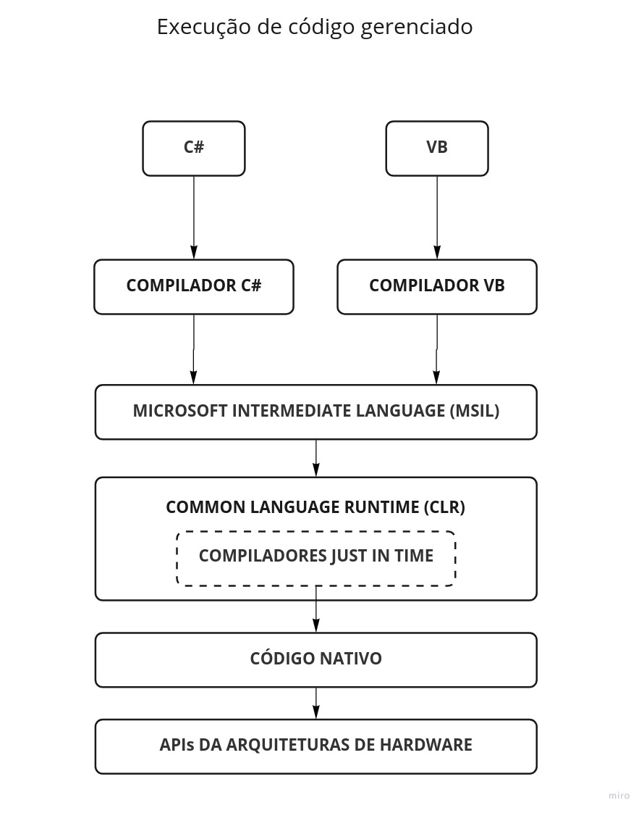

# Me tornando um desenvolvedor .NET #0 

**No começo do mês de Agosto**, iniciei meus estudos do ecossistema .NET, o
ambiente de desenvolvimento da Microsoft. Este e os próximos artigos representam
meus esforços de aprendizado e a vontade de compartilhar conhecimento com quem
também está começando.

Este artigo, abrange conceitos que ainda estou compreendendo, portanto, está
sujeito a falhas de interpretação ou nomenclatura. Contudo, há um grande esforço
de checagem e validação das informações. Caso você encontre erros e/ou algo não
tenha ficado claro o suficiente, por favor, não hesite em me procurar para que
eu possa melhorar.

Quero ressaltar que os conteúdos que serão publicados não possuem o objetivo de
serem tutoriais, mas resumos dos meus estudos. Este _disclaimer_ se faz
necessário, pois é possível que eu pule etapas consideradas mais básicas por já
ter consolidado o conhecimento ou por não estarem no escopo. Por outro lado,
como se trata de algo novo para mim, alguns temas de base serão abordados.

Dito isso, gostaria de pedir, tanto para programadores iniciantes, como eu,
quanto para aqueles com mais experiência, que se sintam a vontade par entrar em
contato, tirar dúvidas, dar feedback ou contribuir para a melhoria do conteúdo.
Só assim poderemos evoluir juntos.

---

## Introdução

Há muito material online sobre a estrutura do ambiente de desenvolvimento da
Microsoft. Neste artigo irei abordar o que considero mais relevante para
compreensão desse ecossistema raro. Uso a palavra “raro” porque realmente
existem poucos frameworks no mercado que oferecem tantas ferramentas integradas
para desenvolvimento de software.

Tem me ajudado conhecer a plataforma mais afundo. Seus conceitos e funcionamento
trazem um conhecimento rico que me esforço para resumir abordando os seguintes
tópicos:

- Visão geral
  - Histórico do .NET - Importante para sabermos com o que estamos lidando.
  - Componentes do ecossistema .NET
  - CLR - COMMON LANGUAGE RUNTIME
  - CLS - COMMON LANGUAGE SPECIFICATION
  - CTS - COMMON TYPE SPECIFICATION
  - BCL - BASE CLASS LIBRARY
  - Processo de Execução Gerenciado

---

## Visão Geral: Histórico do .NET

Como muitos sabem, .NET Framework foi criado na década de 1990, com o nome de
NGWS (Next Generation Windows Services) para desenvolver aplicações da
Microsoft. No fim de 2001, as primeiras versões beta do .NET foram lançadas e,
em 2002, foi lançada a versão 1.0 trazendo o código gerenciado (veremos o que é
isso mais pra frente) para o Windows NT 4.0, 98, 2000, ME, XP.

Um longo caminho foi percorrido e a plataforma teve diversas versões, todas
side-by-side (isto é, você pode ter várias versões instaladas trabalhando lado a
lado). Até que, em 2014, a Microsoft passou por uma transição profunda no modelo
de atuação que influenciou (e influencia até hoje) seus produtos: a saída de
Steve Ballmer e a entrada de
[Satya Nadella como novo CEO da empresa](https://codigofonte.com.br/noticias/leia-a-primeira-mensagem-de-satya-nadella-aos-funcionarios-da-microsoft).

Podemos dizer que Satya Nadella entendeu que a cultura monolítica, fechada e
extremamente competitiva da Microsoft não era mais a adequada ao mercado cada
vez mais volátil, mais focado em serviços e definitivamente integrado com
soluções concorrentes. De uma grande caixa-preta, “ame-a ou deixe-a”, a
Microsoft passou a vender a imagem de uma empresa que colabora com a comunidade
de desenvolvimento, respeita seus adversários e permite que o consumidor misture
produtos sem ficar preso ao seu ecossistema.

Obviamente essa reestruturação iria se refletir na plataforma de desenvolvimento
que já sofria com características limitadas de desenvolvimento multiplataforma,
baixa performance e baixo suporte a arquitetura de microsserviços. Então, todo o
esforço futuro do .NET Framework passou a ser endereçado ao projeto que ficou
conhecido como .NET Core, um novo framework que seria desenvolvido do zero para
dar suporte multiplataforma (Linux, MacOs) com a mesma ideia e recursos do irmão
mais velho.

Esse projeto começou em 2015 e até 2019 a empresa tinha 2 Frameworks no mercado,
o .NET Framework, que era mais completo, mas rodava apenas em ambientes Windows
e o .NET Core, que ainda estava em desenvolvimento, mas tinha suporte a outros
sistemas operacionais. Com o lançamento do .NET Core 3, em 2019, o framework
passou a suportar desenvolvimento de aplicações desktop, IA/Machine Learning e
apps IoT. Era, então, apenas uma questão de tempo para uma nova grande mudança.
E ela veio em 2020.

Após o .NET Core 3.1, que já possuía quase todas as funcionalidades do .NET
Framework e suporte multiplataforma, digamos que a Microsoft não viu mais
sentido em manter dois frameworks e anunciou o .NET 5. O .NET Framework foi
descontinuado (então não, não é uma versão posterior ao .NET Framework 4.x), e o
.NET 5 se tornou o único a ser atualizado, justificando a remoção do nome “CORE”
da marca. Portanto, o .NET 5 é a “unificação” do .NET Framework com o .NET Core.

Com atualizações anuais, no mês de novembro, e versões pares com suporte LTS, já
foram anunciadas as atualizações para .NET 7, esse ano (2022) e .NET 8 LTS
(2023).

Para nós, programadores, essa história significa o seguinte: Apesar das versões
mais antigas não receberem mais atualizações, apenas correções de segurança e
bugs, elas existem e algumas empresas ainda trabalham com código legado. Por
isso a importância de saber com qual versão se está trabalhando e suas
particularidades. Contudo, não faz o menor sentido iniciar novos projetos com
versões anteriores ao .NET 5. Mas, ao que se dá o sucesso da plataforma de um
ponto de vista operacional? Vamos entender melhor a arquitetura e seus
componentes.

---

## Componentes .NET

Ok, somos novos no ramo. Talvez nem tudo fique claro logo de cara. Mas imagine
comigo: A primeira suposição que fazemos é que um programa é escrito em uma
linguagem de programação específica. Logo descobrimos que todos os programas
precisam de alguma biblioteca de tempo de execução que lhes permita interagir
com os outros recursos da máquina (como entrada do usuário, arquivos de disco,
comunicações de rede, etc).

Para isso acontecer, o programa também precisa ser convertido de alguma forma
(por interpretação ou compilação) para um formato que o hardware nativo possa
executar diretamente.

Então, esse programa direcionado para um formato específico de hardware, agora
tem que se integrar com outros programas escritos em outras linguagens que devem
interagir, de alguma forma, com os mesmos ou com outros recursos de hardware… Um
processador vai fazer o trabalho, mas cada CPU tem sua própria arquitetura.

Bom, é aqui que a imaginação acaba, porque essas dependências são tão numerosas,
interdependentes e diversas que os implementadores de linguagens de programação
quase sempre direcionam seus esforços a uma arquitetura de hardware específica
(por exemplo, X86) e a um ambiente de sistema operacional (por exemplo, Windows,
Linux ou Mac OS), que possui uma especificação que descreve o formato do arquivo
executável e especifica como ele será carregado. No fim das contas, os
programadores não fazem um "executável C++", mas sim um "executável Windows X86"
ou um "executável Power PC Mac OS".

Haja abstração. Porém elas existem, ou você não estaria em um computador agora.
Na verdade, a grande maioria dessas abstrações razoavelmente completas foi
construída para linguagens únicas. Por exemplo, o tempo de execução Java, o
interpretador Perl são exemplos.

No começo do artigo, eu mencionei a palavra “raro” para me referir ao ambiente
.NET, acho que agora, por contraste, vai ficar mais claro o que quis dizer:

Não precisa de muito esforço para entender que especificar e implementar todos
esses detalhes que imaginamos seja uma tarefa enorme. É aqui que entra o COMMON
LANGUAGE RUNTIME e o motivo de ser muito raro.

O CLR é a base onde os aplicativos .NET são construídos. É ele que gerencia tudo
o que acontece por trás dos panos enquanto programamos. Uma definição seria:

> _O Common Language Runtime (CLR) é uma máquina virtual completa e de alto
> nível projetada para suportar uma ampla variedade de linguagens de programação
> e interoperação entre elas._

Isso pode não ser muito esclarecedor quanto a sua raridade ou seu sucesso, por
outro lado é um primeiro passo para agrupar seus recursos de maneira
compreensível. É o que vou tentar fazer a seguir.

## CLR - COMMON LANGUAGE RUNTIME

Para começar, o CLR não é bem-sucedido devido a qualquer recurso específico que
ele suporta – como coleta de lixo, independência de plataforma, programação
orientada a objetos ou suporte a versões (coisas que serão abordadas
futuramente). O CLR é bem-sucedido porque todos esses recursos, assim como
vários outros, se combinam para tornar a programação significativamente mais
fácil, permitindo que diferentes linguagens se comuniquem entre si com
construções de alto nível que reduzem drasticamente o trabalho de interoperação.

Fácil aqui significa o seguinte:

1. Linguagens simplificadas (por exemplo, C# e Visual Basic são
   significativamente mais simples que C++, linguagem geralmente usada na
   implementação de APIs dos sistemas operacionais)
2. Uma dedicação à simplicidade na biblioteca de classes (por exemplo, temos
   apenas um tipo de string e é imutável; isso simplifica muito qualquer API que
   use strings)
3. Forte consistência na nomenclatura na biblioteca de classes (por exemplo,
   exigindo que as APIs usem convenções de nomenclatura consistentes)
4. Ótimo suporte na cadeia de ferramentas necessária para criar um aplicativo
   (por exemplo, o Visual Studio torna a criação de aplicativos CLR muito
   simples e o Intellisense facilita muito a localização dos tipos e métodos
   corretos para criar o aplicativo).

A partir desse conhecimento, podemos fazer um primeiro desenho dos componentes
básicos gerenciados pelo CLR da seguinte forma:

Na primeira camada (de cima para baixo) temos as linguagens de programação cujos
compiladores são suportadas pelo runtime. Logo abaixo temos as especificações de
tipo e de linguagem.

### CTS - COMMON TYPES SPECIFICATION

O CTS descreve um conjunto de tipos de dados que podem ser usados por diferentes
linguagens comuns ao .Net (ou seja, na prática, o CTS garante que eu possa
escrever uma classe em Python, por exemplo, e derivar dela em C#).

Para comunicação entre programas escritos em qualquer linguagem suportada pelo
.NET (mais de 50 linguagens) os tipos têm que ser compatíveis no nível básico,
isto é, o sistema deve suportar duas categorias:

**Tipos de valor**:

Onde os objetos são representados por seus valores. Se você atribuir um tipo de
valor a uma variável, estará essencialmente copiando um valor do objeto.

**Tipos de referência:**

Os tipos de referência são representados por uma referência ao valor real do
objeto. Ele simplesmente se refere a um local de memória onde estão os valores
dos objetos. Isso tem um impacto profundo em como esses tipos são usados. Se
você atribuir um tipo de referência a uma variável e, em seguida, passar essa
variável para um método, por exemplo, quaisquer alterações no objeto serão
refletidas no objeto principal; não há cópia.

O CTS também define todas as outras propriedades dos tipos, como modificadores
de acesso, quais são os membros de tipo válidos, como a herança e a sobrecarga
funcionam e assim por diante. Infelizmente, meu conhecimento ainda não vai muito
além disso, então falarei mais profundamente em um outro artigo.

### CLS - COMMON LANGUAGE SPECIFICATION

O CLS é um subconjunto do CTS. Isso significa que todas as regras do CTS também
se aplicam ao CLS, a menos que as regras do CLS sejam mais rígidas. Entretanto,
é o CLS que fornece uma espécie de receita semântica para qualquer linguagem que
seja implementada. Em outras palavras, o CLS define uma série de regras
semânticas que são compartilhadas entre as linguagens com o objetivo de garantir
interoperabilidade completa entre elas.

### Frameworks de Desenvolvimento

Na próxima camada, temos os frameworks de desenvolvimento .Net. Eu não entrarei
no detalhes de todos. Eu tenho me dedicado a entender mais profundamente o
ASP.NET. É dele que falarei mais em artigos futuros, no entanto a definição de
cada plataforma pode ser:

**WinForms** – uma estrutura para criação de interface do usuário que cria
aplicativos cliente de desktop avançados para Windows. A plataforma de
desenvolvimento do Windows Forms oferece suporte a um amplo conjunto de recursos
de desenvolvimento de aplicativos, incluindo controles, gráficos e vinculação de
dados e entrada do usuário.

**ASP.NET** – É usado para desenvolver aplicativos baseados na web, desde sites
usando HTML, CSS e Javascript até APIs Web, além de facilitar o uso de
tecnologias em tempo real como Web Sockets.

**ADO.NET** – é um conjunto de classes que expõe serviços de acesso a dados para
programadores do .NET Framework. O ADO.NET fornece um rico conjunto de
componentes para a criação de aplicativos distribuídos de compartilhamento de
dados.

### BCL - BASE CLASS LIBRARY

Por fim, mas não menos importante, a BCL. Uma coleção de métodos e funções que
podem ser usados ​​para o propósito da aplicação. A estrutura .NET fornece um
conjunto de bibliotecas de classes básicas com diversos recursos que podem ser
usados ​​por qualquer linguagem de programação que implemente .NET.

Por exemplo, existe uma biblioteca de classes com métodos para lidar com todas
as operações em nível de arquivo. Portanto, existe um método que pode ser usado
para ler o texto de um arquivo. Da mesma forma, existe um método para escrever
texto em um arquivo.

A maioria dos métodos é dividida nos namespaces System._ ou Microsoft._. (o
asterisco significa apenas uma referência a todos os métodos que se enquadram no
namespace System ou Microsoft).

Um namespace é uma separação lógica de métodos. Veremos mais detalhes sobre
namespaces em um próximo estudo.

## Processo de Execução Gerenciado

Juntando tudo que vimos: o CLR tem a característica matadora de ser multilingue.
Cada linguagem/compilador que é suportado pelo ecossistema e que se beneficie do
CLR é chamado de **código gerenciado** (Porque é gerenciado pelo CLR), do
contrário é chamado de **código não gerenciado**.

O código gerenciado, no caso do .NET, permite que objetos escritos em diferentes
linguagens possam se comunicar uns com os outros e seus comportamentos podem ser
fortemente integrados. Por exemplo: você pode definir uma classe em C# e usar
uma linguagem diferente para derivar dessa classe ou chamar um método definido
nela, ou pode passar uma instância de uma classe para um método de uma classe
escrita em um idioma diferente.

O CLR é capaz disso por possuir especificações de tipagem e semântica que
garantem que, no fim das contas, não compilamos um “código C# ” e sim um código
que irá implementar as APIs da arquitetura da SO. Veremos agora como isso é
possível:

Cada linguagem suportada pelo CLR possui suas ferramentas, entre elas está o seu
compilador. O compilador da linguagem que você usa determina quais recursos de
tempo de execução estão disponíveis e você projeta seu código usando esses
recursos. Seu compilador, **não o tempo de execução**, estabelece a sintaxe que
seu código deve usar (conforme as especificações de tipo e linguagem).

Quando seu código é compilado, é gerado um arquivo chamado de **Assembly**. Os
assemblies são usados para os próprios programas, bem como para quaisquer
bibliotecas dependentes. É um formato de arquivo binário totalmente especificado
e padronizado pela
[ECMA 335](https://www.ecma-international.org/publications-and-standards/standards/ecma-335/).
Todos os compiladores de linguagem suportados pelo .NET usam esse formato.

Entretanto, na prática, um assembly é o produto da compilação do seu código
escrito em C#, VB, F#, etc. em uma linguagem intermediária chamada de **MSIL
(Microsoft Intermediate Language)**. Uma linguagem intermediária independente do
CPU, isto é, ainda não é a linguagem de máquina (**código nativo ou não
gerenciado**), mas uma linguagem desenvolvida para se comunicar da melhor
maneira com as APIs fornecidas pela arquitetura do sistema operacional.

O MSIL inclui instruções para carregar, armazenar, inicializar e chamar métodos
em objetos, bem como instruções para operações aritméticas e lógicas, fluxo de
controle, acesso direto à memória, tratamento de exceção e outras operações.

Quando esse binário é executado, ele passa por uma outra compilação, dessa vez,
por um dos **compiladores JIT (Just-in-Time)** que também são fornecidos pelo
CLR. Esse tipo de compilador traduz, **em tempo de execução**, o código
intermediário em código nativo específico para aquele CPU.

Ser traduzido em tempo de execução significa o seguinte: O compilador JIT
converte o código intermediário em código nativo durante a execução do programa
sob-demanda.

Isso, por sua vez, quer dizer que a compilação JIT leva em consideração a
possibilidade de que algum código nunca seja chamado durante a execução. Logo,
em vez de usar tempo e memória para converter todo o MSIL em código nativo, ele
o converte conforme necessário durante a execução e armazena o código nativo
resultante na memória para que seja acessível para chamadas subsequentes no
contexto desse processo.

Outros processos ocorrem nesse momento, por exemplo, um compilador **JIT também
otimiza o código a cada execução.**. Ou seja, toda vez que o IL é executado, o
compilador o torna mais eficaz. É possível que você ouça de um desenvolvedor
mais experiente uma expressão do tipo: “Vamos esperar o código esquentar”. Agora
você sabe que ele está fazendo referência à otimização do código a cada execução
;)

Também existem diferentes tipos de compilação JIT, no entanto, fogem um pouco do
escopo deste artigo e serão abordados com mais detalhes nos próximos que desejo
publicar sobre o assunto.

---

**Para concluirmos esse conteúdo introdutório**, o CRL, além de gerenciar todos
esses componentes, possui muitos outros recursos, por isso é útil categorizá-los
da seguinte forma:

1. **Recursos fundamentais** – Recursos que têm amplo impacto no design de
   outros recursos. Esses incluem:
1. Coleta de lixo
1. Segurança de memória e segurança de tipo
1. Suporte de alto nível para linguagens de programação.
1. **Recursos secundários** – Recursos habilitados pelos recursos fundamentais
   que podem não ser exigidos:
1. Isolamento de programa com AppDomains
1. Segurança do programa e sandboxing
1. **Outros recursos** – recursos que todos os ambientes de tempo de execução
   precisam, mas que não aproveitam os recursos fundamentais do CLR. Em vez
   disso, eles são o resultado do desejo de criar um ambiente de programação
   completo. Entre eles estão:
1. Controle de versão
1. Depuração/Perfil
1. Interoperação

Para os próximos artigos eu irei me aprofundar um pouco mais em alguns desses
recursos. Por agora, podemos resumir o Runtime do .NET como uma especificação
completa dos bits exatos que se deve colocar em um arquivo para criar e executar
um programa. É uma máquina virtual que executa esses arquivos e está em um alto
nível de abstração apropriado para implementar uma ampla classe de linguagens de
programação. Essa máquina virtual, juntamente com um corpo cada vez maior de
bibliotecas de classes, é o que define o COMMON LANGUAGE RUNTIME.

---

**FONTES:**

- [Visão geral do Common Language Runtime (CLR](https://docs.microsoft.com/en-us/dotnet/standard/clr)
- [Introdução ao Common Language Runtime (CLR)](https://github.com/dotnet/runtime/blob/main/docs/design/coreclr/botr/intro-to-clr.md)
- [O que é .NET? Introdução e Visão geral](https://docs.microsoft.com/en-us/dotnet/core/introduction)
- [Independência de idioma e componentes independentes de idioma](https://docs.microsoft.com/en-us/dotnet/standard/language-independence)
- [Formato de arquivo de montagem .NET](https://docs.microsoft.com/en-us/dotnet/standard/assembly/file-format)
- [Processo de execução gerenciada](https://docs.microsoft.com/en-us/dotnet/standard/managed-execution-process#choosing_a_compiler)
- [Bibliotecas de classe .NET](https://docs.microsoft.com/en-us/dotnet/standard/class-libraries)

**AGRADECIMENTO:**
[**Marcelo Castelo Branco**](https://www.linkedin.com/in/marcelocastelobranco/),
Engenheiro de Software Sênior na XP.inc. primeiro pela paciência, depois pela
didática: sempre trazendo exemplos das minhas experiências passadas para essa
nova empreitada. E por se dispor a me mentorear e se comprometer com minha
evolução! Valeu, cara!
